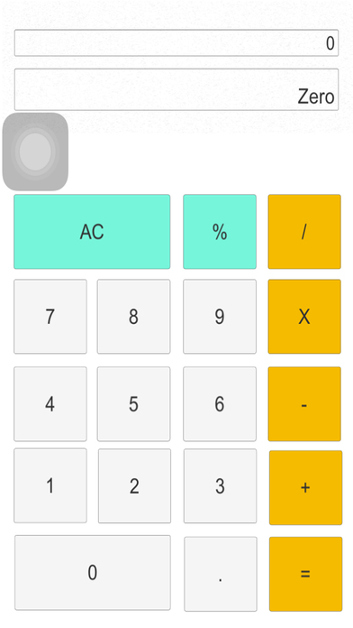
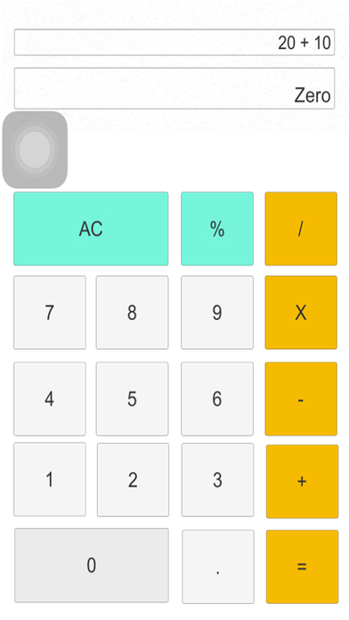
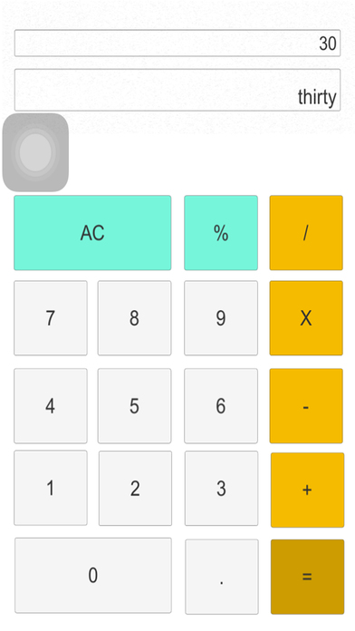

# Calculator-Number-to-Words
Developer:ojikutu idowu

Calculator: Number to Words Application that will output any number to words  

This application is free of virus or malware  

<h3>Software Requirment </h3>
Unity 5.6 
Unity C# 

<h3>Application Functions</h3>
1) Calculator  
2) Convert Number into Word  

<h3>Source Code</h3>

	//Calulation to Words
	public string DecimalToWords(decimal number)
	{
		if (number == 0)
			return "zero";

		if (number < 0)
			return "minus " + DecimalToWords(Math.Abs(number));

		string words = "";

		long intPortion = (long)number;
		decimal fraction = (number - intPortion)*100;
		long decPortion = (long)fraction;

		words = NumberToWords(intPortion);
		if (decPortion > 0)
		{
			words += " and ";
			words += NumberToWords(decPortion);
		}
		return words;
	}

	public static string NumberToWords(long number)
	{
		if (number == 0)
			return "zero";

		if (number < 0)
			return "minus " + NumberToWords(Math.Abs(number));

		string words = "";

		if ((number / 1000000000000) > 0)
		{
			words += NumberToWords(number / 1000000000000) + " trillion ";
			number %= 1000000000000;
		}

		if ((number / 1000000000) > 0)
		{
			words += NumberToWords(number / 1000000000) + " billion ";
			number %= 1000000000;
		}

		if ((number / 1000000) > 0)
		{
			words += NumberToWords(number / 1000000) + " million ";
			number %= 1000000;
		}

		if ((number / 1000) > 0)
		{
			words += NumberToWords(number / 1000) + " thousand ";
			number %= 1000;
		}

		if ((number / 100) > 0)
		{
			words += NumberToWords(number / 100) + " hundred ";
			number %= 100;
		}

		if (number > 0)
		{
			if (words != "")
				words += "and ";

			var unitsMap = new[] { "zero", "one", "two", "three", "four", "five", "six", "seven", "eight", "nine", "ten", "eleven", "twelve", "thirteen", "fourteen", "fifteen", "sixteen", "seventeen", "eighteen", "nineteen" };
			var tensMap = new[] { "zero", "ten", "twenty", "thirty", "forty", "fifty", "sixty", "seventy", "eighty", "ninety" };

			if (number < 20)
				words += unitsMap[number];
			else
			{
				words += tensMap[number / 10];
				if ((number % 10) > 0)
					words += "-" + unitsMap[number % 10];
			}
		}

		return words;
	}

<h3>Screenshot</h3>

